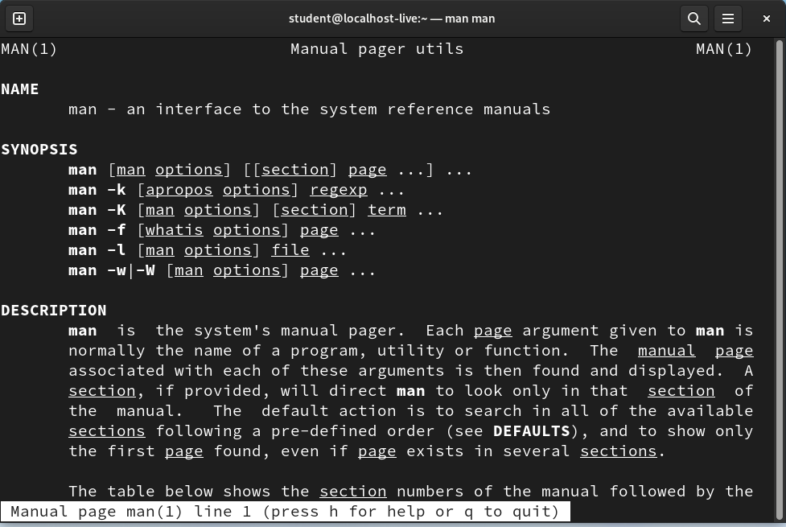
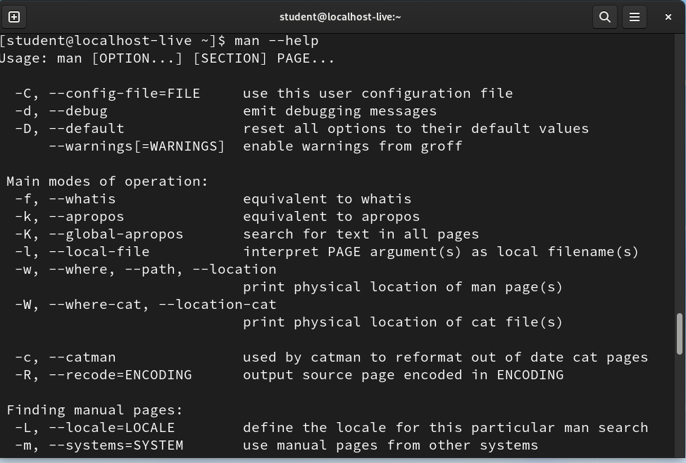

# Getting Help

## Objectives

- man command
- --help

## man command

Linux command documentations are available via the `man` command

The syntax is **man \<command>** where \<command> is the command you want the manual page for.  The following command will show the manual page for the man command:

> man man

If you are unable to find any manual pages after a fresh installation, you may have to run the command `mandb` as the root user to generate the manual pages.  To do so, run the command:

> sudo mandb

**sudo** execute a command as another user. To read the manual page for sudo, run the command:

> man sudo

## --help

Most commands have the `--help` option. This shows the various options of the command. For example:

> man --help

will show the different options available for the **man** command:

