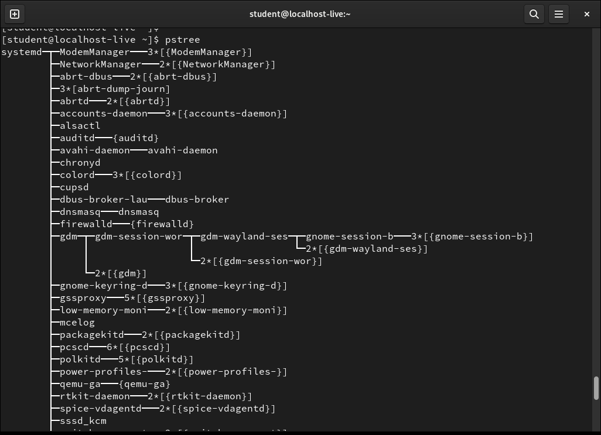
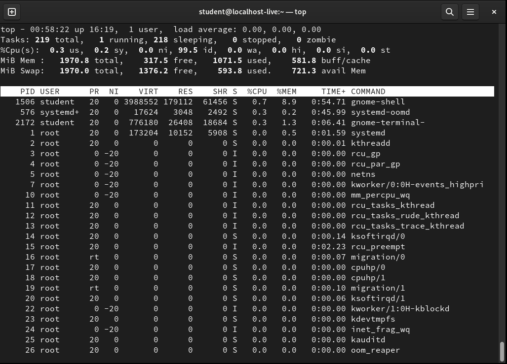

# Linux Processes

## Process ID 1

The first process started on a Linux System has process ID 1.  It is either the `init` process or the `systemd` process.

## pstree

To see a tree of the current running processes, run the following command:

> pstree

The output will be similar to this:

## ps

The `ps` command report a snapshot of the current processes. To find out more about this command, read the manual page:

> man ps

## top

The `top` command can be used to display Linux processes in real time. The output is similar to the following:

## ulimit

`ulimit` can be used to control process limits:

* soft limits - user can modify but cannot exceed the hard limits
* hard limits - only root can modify

Changes when applying `ulimit` is limited to current shell. For permananent changes, you will need to modify /etc/security/limits.conf and reboot the machine. For more information, refer to the man page:

> man limits.conf

## Process Permissions

Process runs with the permissions of the user who started the process.  However in the case of setuid programs, they will run as owners of the programs. An example application is the `passwd` program.

## Process States

Process states can be one of:

* Running
* Sleeping
* Stopped
* Zombie

## Process Modes

Process can be running in user mode or kernal mode.

## Daemons

Daemons are background processes. They usually have no controlling terminal and no input output devices.

## Process Priority

Process priorities can be set by `nice` command when starting the program:

> man nice

For already running processes, `renice` does a similar job:

> man renice

## Libraries

Libraries can be static or shared. The command `ldd` can be used to check shared libraries details, for example:

> ldd /usr/bin/bash

`ldconfig` configures the database that the linker will search for shared libraries.

> man ldconfig

## Lab

1. Controlling process with ulimit
