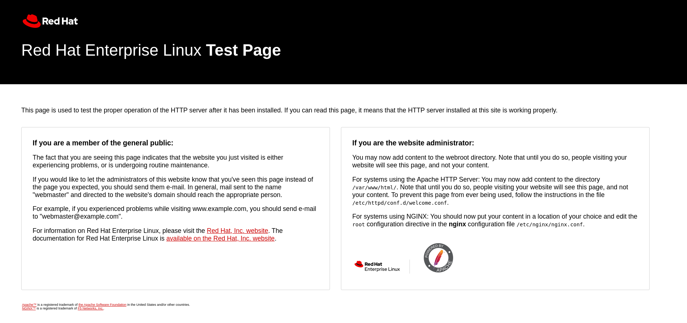

# Linux Services

## Objectives

- Understand services 
- Checking service status
- Starting servoces 
- Stopping services
- Enabling / disabling services

## Introduction

`systemd` is a system and service manager for newer Linux distributions, replacing the traditional SysV init system.

### Services

Services refer to background processes or daemons that run independently to perform specific tasks or provide functionality. These services can include network-related services, system services, and applications that run in the background. 

They contribute to the overall functionality and operation of the Linux system. Examples of services include web servers (e.g., Apache), database servers (e.g., MySQL) and networking services (e.g., SSH).

### Checking service status

`systemctl status` can be used to check the status of the service.  We will use the httpd service for our example. 

```bash
[student@ip-172-31-88-88 ~]$ systemctl status httpd
Unit httpd.service could not be found.
[student@ip-172-31-88-88 ~]$ 
```
The error is due to the `httpd` package is not installed on the system and therefore the service is not found.  

Install the `httpd` package:

```bash
[student@ip-172-31-88-88 ~]$ sudo dnf install httpd -y
Updating Subscription Management repositories.
Unable to read consumer identity

This system is not registered with an entitlement server. You can use subscription-manager to register.

Last metadata expiration check: 18:10:58 ago on Wed 04 Oct 2023 07:50:57 AM UTC.
Dependencies resolved.
================================================================================
 Package            Arch   Version             Repository                  Size
================================================================================
Installing:
 httpd              x86_64 2.4.53-11.el9_2.5   rhel-9-appstream-rhui-rpms  53 k
Installing dependencies:
.
.
<Output Truncated>
.
.
Installed:
  apr-1.7.0-11.el9.x86_64                                                       
  apr-util-1.6.1-20.el9_2.1.x86_64                                              
  apr-util-bdb-1.6.1-20.el9_2.1.x86_64                                          
  apr-util-openssl-1.6.1-20.el9_2.1.x86_64                                      
  httpd-2.4.53-11.el9_2.5.x86_64                                                
  httpd-core-2.4.53-11.el9_2.5.x86_64                                           
  httpd-filesystem-2.4.53-11.el9_2.5.noarch                                     
  httpd-tools-2.4.53-11.el9_2.5.x86_64                                          
  mailcap-2.1.49-5.el9.noarch                                                   
  mod_http2-1.15.19-4.el9_2.4.x86_64                                            
  mod_lua-2.4.53-11.el9_2.5.x86_64                                              
  redhat-logos-httpd-90.4-1.el9.noarch                                          

Complete!
```
Check the status of the `httpd` service: 

```bash
[student@ip-172-31-88-88 ~]$ systemctl status httpd
○ httpd.service - The Apache HTTP Server
     Loaded: loaded (/usr/lib/systemd/system/httpd.service; disabled; preset: d>
     Active: inactive (dead)
       Docs: man:httpd.service(8)
lines 1-4/4 (END)
```
The output is displayed in a pager.  To exit, type `q`.

`Loaded: loaded (/usr/lib/systemd/system/httpd.service; disabled; preset: d>` indicates that the service is disabled.  This means that it will not start automatically on boot.

`Active: inactive (dead)` indicate that the service is not currently running. 


### Starting Services

Starting and stopping services are performed using the **systemctl** command.  The `systemctl` command controls the systemd system and service manager.  

To start a service, you can use `systemctl start`.  Starting and stopping services require root privileges. 

```bash
[student@ip-172-31-88-88 ~]$ systemctl start httpd
==== AUTHENTICATING FOR org.freedesktop.systemd1.manage-units ====
Authentication is required to start 'httpd.service'.
Authenticating as: root
Password: 
```
We will break out of this prompt by keying in `Ctrl-C` as we do not know the root password.  We will elevate to root using the `sudo` command instead:

```bash
[student@ip-172-31-88-88 ~]$ sudo systemctl start httpd
[student@ip-172-31-88-88 ~]$ 
```
There are no errors displayed.  Check the status using `systemctl status`:

```bash
[student@ip-172-31-88-88 ~]$ systemctl status httpd
● httpd.service - The Apache HTTP Server
     Loaded: loaded (/usr/lib/systemd/system/httpd.service; disabled; preset: d>
     Active: active (running) since Thu 2023-10-05 02:17:27 UTC; 58s ago
       Docs: man:httpd.service(8)
   Main PID: 2332 (httpd)
     Status: "Total requests: 0; Idle/Busy workers 100/0;Requests/sec: 0; Bytes>
      Tasks: 213 (limit: 4421)
     Memory: 25.4M
        CPU: 102ms
     CGroup: /system.slice/httpd.service
             ├─2332 /usr/sbin/httpd -DFOREGROUND
             ├─2333 /usr/sbin/httpd -DFOREGROUND
             ├─2334 /usr/sbin/httpd -DFOREGROUND
             ├─2335 /usr/sbin/httpd -DFOREGROUND
             └─2336 /usr/sbin/httpd -DFOREGROUND

.
.
.
<Output Truncated>
```
The output shows that the web service is running and a bunch of details.  

You can now try to access the webserver.  The `wget` program can be used to fetch webpages.  Install `wget`:

```bash
[student@ip-172-31-88-88 ~]$ sudo dnf install wget
Updating Subscription Management repositories.
Unable to read consumer identity

This system is not registered with an entitlement server. You can use subscription-manager to register.

Last metadata expiration check: 0:22:29 ago on Thu 05 Oct 2023 02:02:06 AM UTC.
Dependencies resolved.
================================================================================
 Package   Arch        Version            Repository                       Size
================================================================================
Installing:
 wget      x86_64      1.21.1-7.el9       rhel-9-appstream-rhui-rpms      794 k

Transaction Summary
================================================================================
Install  1 Package

Total download size: 794 k
Installed size: 3.1 M
Is this ok [y/N]: y
Downloading Packages:
wget-1.21.1-7.el9.x86_64.rpm                     16 MB/s | 794 kB     00:00    
--------------------------------------------------------------------------------
Total                                           9.7 MB/s | 794 kB     00:00     
Running transaction check
Transaction check succeeded.
Running transaction test
Transaction test succeeded.
Running transaction
  Preparing        :                                                        1/1 
  Installing       : wget-1.21.1-7.el9.x86_64                               1/1 
  Running scriptlet: wget-1.21.1-7.el9.x86_64                               1/1 
  Verifying        : wget-1.21.1-7.el9.x86_64                               1/1 
Installed products updated.

Installed:
  wget-1.21.1-7.el9.x86_64                                                      

Complete!
```

Access the webserver on the localhost by issuing the command `wget 127.0.0.1` which is the loopback address of the server. 

```bash
[student@ip-172-31-88-88 ~]$ wget 127.0.0.1
--2023-10-05 02:24:47--  http://127.0.0.1/
Connecting to 127.0.0.1:80... connected.
HTTP request sent, awaiting response... 403 Forbidden
2023-10-05 02:24:47 ERROR 403: Forbidden.
```
This shows that the server is up and running.  The default behaviour in this case restricts access.  

You can also access the webserver via the public IP address.  A webpage such as the one below should show up.  


### Stopping services

To stop the service, use the `systemctl stop` command.  As a good practice, check the status after you have stopped the service.  

```bash
[student@ip-172-31-88-88 ~]$ sudo systemctl stop httpd
[student@ip-172-31-88-88 ~]$ sudo systemctl status httpd
○ httpd.service - The Apache HTTP Server
     Loaded: loaded (/usr/lib/systemd/system/httpd.service; disabled; preset: d>
     Active: inactive (dead)
       Docs: man:httpd.service(8)

Oct 05 02:17:27 ip-172-31-92-134.ec2.internal systemd[1]: Starting The Apache H>
Oct 05 02:17:27 ip-172-31-92-134.ec2.internal systemd[1]: Started The Apache HT>
Oct 05 02:17:27 ip-172-31-92-134.ec2.internal httpd[2332]: Server configured, l>
Oct 05 02:40:03 ip-172-31-92-134.ec2.internal systemd[1]: Stopping The Apache H>
Oct 05 02:40:04 ip-172-31-92-134.ec2.internal systemd[1]: httpd.service: Deacti>
Oct 05 02:40:04 ip-172-31-92-134.ec2.internal systemd[1]: Stopped The Apache HT>
lines 1-11/11 (END)
```


### Enabling / disabling services

`systemctl start` and `systemctl stop` affects the current status of the service, it does not control whether the service should be started during reboot.  

To ensure that the service comes on automatically on reboot, `systemctl enable` is used.  

```bash
[student@ip-172-31-88-88 ~]$ sudo systemctl enable httpd
Created symlink /etc/systemd/system/multi-user.target.wants/httpd.service → /usr/lib/systemd/system/httpd.service.
[student@ip-172-31-88-88 ~]$ systemctl status httpd
○ httpd.service - The Apache HTTP Server
     Loaded: loaded (/usr/lib/systemd/system/httpd.service; enabled; preset: di>
     Active: inactive (dead)
       Docs: man:httpd.service(8)

Oct 05 02:17:27 ip-172-31-92-134.ec2.internal systemd[1]: Starting The Apache H>
Oct 05 02:17:27 ip-172-31-92-134.ec2.internal systemd[1]: Started The Apache HT>
Oct 05 02:17:27 ip-172-31-92-134.ec2.internal httpd[2332]: Server configured, l>
Oct 05 02:40:03 ip-172-31-92-134.ec2.internal systemd[1]: Stopping The Apache H>
Oct 05 02:40:04 ip-172-31-92-134.ec2.internal systemd[1]: httpd.service: Deacti>
Oct 05 02:40:04 ip-172-31-92-134.ec2.internal systemd[1]: Stopped The Apache HT>
lines 1-11/11 (END)
```


Conversely to ensure that the service is not turned on during system boot, use the `systemctl disable` command.  

```bash
[student@ip-172-31-88-88 ~]$ sudo systemctl disable httpd
Removed "/etc/systemd/system/multi-user.target.wants/httpd.service".
[student@ip-172-31-88-88 ~]$ systemctl status httpd
○ httpd.service - The Apache HTTP Server
     Loaded: loaded (/usr/lib/systemd/system/httpd.service; disabled; preset: d>
     Active: inactive (dead)
       Docs: man:httpd.service(8)

Oct 05 02:17:27 ip-172-31-92-134.ec2.internal systemd[1]: Starting The Apache H>
Oct 05 02:17:27 ip-172-31-92-134.ec2.internal systemd[1]: Started The Apache HT>
Oct 05 02:17:27 ip-172-31-92-134.ec2.internal httpd[2332]: Server configured, l>
Oct 05 02:40:03 ip-172-31-92-134.ec2.internal systemd[1]: Stopping The Apache H>
Oct 05 02:40:04 ip-172-31-92-134.ec2.internal systemd[1]: httpd.service: Deacti>
Oct 05 02:40:04 ip-172-31-92-134.ec2.internal systemd[1]: Stopped The Apache HT>
lines 1-11/11 (END)
```

## Lab

1. Install the httpd package
2. Start the httpd service
3. Check the current status of the httpd
4. Stop the httpd service
5. Enable the httpd service
6. Reboot the server and verify that the httpd service is enabled

## Conclusion

In this chapter we have investigated services on Linux and controlling a service using the `systemctl` command.  

## References

[Apache HTTP Server Project](https://projects.apache.org/project.html?httpd-http_server)