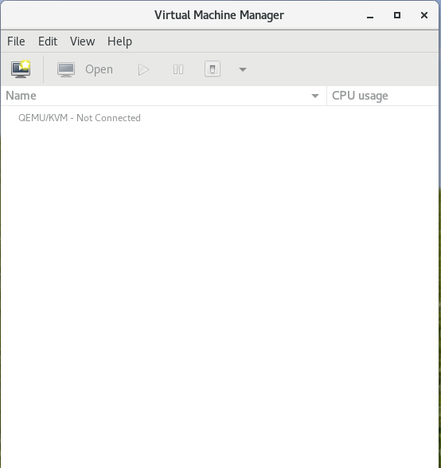

# Kernel-based Virtual Machine (KVM) and libvirt

## KVM Overview

[KVM](https://www.linux-kvm.org/page/Main_Page) (for Kernel-based Virtual Machine) is a full virtualization solution for Linux on x86 hardware containing virtualization extensions (Intel VT or AMD-V).

## libvirt Overview

The [libvirt project](https://libvirt.org/) is a toolkit to manage virtualization platforms including KVM.

Common applications:

* virt-manager - Virtual Machine Manager

* virsh - main  interface  for managing virsh guest domains

## QEMU

[QEMU](https://wiki.qemu.org/Main_Page) is a generic and open source machine emulator and virtualizer.

When used as a virtualizer, QEMU achieves near native performance by executing the guest code directly on the host CPU. QEMU supports virtualization when executing under the Xen hypervisor or using the KVM kernel module in Linux. When using KVM, QEMU can virtualize x86, server and embedded PowerPC, 64-bit POWER, S390, 32-bit and 64-bit ARM, and MIPS guests.

## Tools

Tools to manage KVM on Linux include:

* qemu-*
* virt-*

## Labs

* Demo: Installing a virtual machine on KVM
